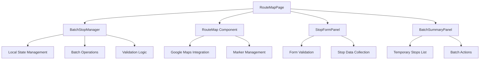

# Batch Stop Adding Feature - Design Document

## Overview

This design document outlines the technical implementation for the batch stop adding feature, which allows users to add multiple bus stops locally before committing them to the backend in a single operation. The design focuses on state management, user interface components, and data flow to provide a seamless batch editing experience.

## Architecture

### High-Level Architecture



### Component Hierarchy

```
RouteMapPage
├── BatchModeHeader (new)
├── RouteMap
│   ├── SavedStopMarkers
│   ├── TemporaryStopMarkers (new)
│   └── MapClickHandler
├── StopFormPanel (enhanced)
│   ├── StopDetailsForm
│   └── BatchActionButtons (new)
├── BatchSummaryPanel (new)
│   ├── TemporaryStopsList
│   └── BatchOperationButtons
└── ConfirmationDialogs (new)
```

## Data Models

### Temporary Stop Interface

```typescript
interface TemporaryStop {
  id: string; // Temporary UUID
  coordinates: {
    lat: number;
    lng: number;
  };
  address: string;
  busStopIndex: number;
  direction: string;
  type: string;
  createdAt: Date;
  isValid: boolean;
  validationErrors?: string[];
}
```

### Batch Session State

```typescript
interface BatchSession {
  isActive: boolean;
  temporaryStops: TemporaryStop[];
  currentEditingStop: TemporaryStop | null;
  isSaving: boolean;
  saveProgress: {
    total: number;
    completed: number;
    failed: string[];
  };
}
```

### Enhanced Route Map State

```typescript
interface RouteMapState {
  // Existing state
  route: Route | null;
  loading: boolean;
  error: ApiError | null;
  selectedStop: any | null;
  infoPanelOpen: boolean;
  isAddMode: boolean;
  isEditMode: boolean;
  
  // New batch-related state
  batchSession: BatchSession;
  showBatchSummary: boolean;
  pendingConfirmation: 'exit' | 'clear' | null;
}
```

## Components and Interfaces

### 1. BatchModeHeader Component

**Purpose**: Display batch mode status and primary actions

```typescript
interface BatchModeHeaderProps {
  temporaryStopsCount: number;
  isActive: boolean;
  onSaveAll: () => void;
  onDoneAdding: () => void;
  onClearAll: () => void;
  isSaving: boolean;
  saveProgress?: {
    total: number;
    completed: number;
  };
}
```

**Features**:
- Shows "Batch Add Mode" indicator
- Displays count of temporary stops
- "Save All Stops" button with progress indicator
- "Done Adding" button
- "Clear All" button for removing all temporary stops

### 2. Enhanced StopFormPanel Component

**Purpose**: Form for adding/editing individual stops with batch actions

```typescript
interface StopFormPanelProps {
  stop: TemporaryStop | null;
  isTemporary: boolean;
  onAddToBatch: (stopData: TemporaryStop) => void;
  onAddAndSaveAll: (stopData: TemporaryStop) => void;
  onCancel: () => void;
  onUpdate: (stopData: TemporaryStop) => void;
  onDelete: (stopId: string) => void;
  validationErrors?: string[];
}
```

**Features**:
- Form fields for stop details
- "Add to Batch" button (replaces "Save & Continue Adding")
- "Add & Save All" button (replaces "Save & Done")
- Real-time validation
- Edit mode for temporary stops

### 3. BatchSummaryPanel Component

**Purpose**: Show list of temporary stops and batch operations

```typescript
interface BatchSummaryPanelProps {
  temporaryStops: TemporaryStop[];
  onEditStop: (stopId: string) => void;
  onDeleteStop: (stopId: string) => void;
  onReorderStops: (stops: TemporaryStop[]) => void;
  onSaveAll: () => void;
  onClearAll: () => void;
  isVisible: boolean;
  onToggleVisibility: () => void;
}
```

**Features**:
- Collapsible panel showing all temporary stops
- Drag-and-drop reordering
- Individual stop edit/delete actions
- Batch operation buttons
- Stop validation status indicators

### 4. TemporaryStopMarker Component

**Purpose**: Visual representation of unsaved stops on the map

```typescript
interface TemporaryStopMarkerProps {
  stop: TemporaryStop;
  index: number;
  isSelected: boolean;
  onClick: (stop: TemporaryStop) => void;
  onEdit: (stop: TemporaryStop) => void;
  onDelete: (stopId: string) => void;
}
```

**Features**:
- Distinct visual style (dashed border, different color)
- Hover tooltips with stop details
- Click to select/edit
- Context menu for actions

## State Management Strategy

### Local State Architecture

```typescript
// Main state management in RouteMapPage
const [batchSession, setBatchSession] = useState<BatchSession>({
  isActive: false,
  temporaryStops: [],
  currentEditingStop: null,
  isSaving: false,
  saveProgress: { total: 0, completed: 0, failed: [] }
});

// Derived state
const temporaryStopsCount = batchSession.temporaryStops.length;
const hasUnsavedChanges = temporaryStopsCount > 0;
const canSaveAll = temporaryStopsCount > 0 && !batchSession.isSaving;
```

### State Update Patterns

```typescript
// Add temporary stop
const addTemporaryStop = (stopData: Omit<TemporaryStop, 'id' | 'createdAt'>) => {
  const newStop: TemporaryStop = {
    ...stopData,
    id: `temp-${Date.now()}-${Math.random()}`,
    createdAt: new Date(),
    isValid: validateStop(stopData),
    validationErrors: getValidationErrors(stopData)
  };
  
  setBatchSession(prev => ({
    ...prev,
    temporaryStops: [...prev.temporaryStops, newStop]
  }));
};

// Update temporary stop
const updateTemporaryStop = (stopId: string, updates: Partial<TemporaryStop>) => {
  setBatchSession(prev => ({
    ...prev,
    temporaryStops: prev.temporaryStops.map(stop =>
      stop.id === stopId 
        ? { ...stop, ...updates, isValid: validateStop({ ...stop, ...updates }) }
        : stop
    )
  }));
};

// Remove temporary stop
const removeTemporaryStop = (stopId: string) => {
  setBatchSession(prev => ({
    ...prev,
    temporaryStops: prev.temporaryStops.filter(stop => stop.id !== stopId)
  }));
};
```

## User Interface Design

### Visual Design Principles

1. **Clear Visual Distinction**: Temporary stops use dashed borders and orange color scheme
2. **Progressive Disclosure**: Batch summary panel is collapsible
3. **Contextual Actions**: Different button sets based on current mode
4. **Progress Feedback**: Loading states and progress indicators during batch operations

### Layout Structure

```
┌─────────────────────────────────────────────────────────────┐
│ Route Header + Breadcrumbs                                  │
├─────────────────────────────────────────────────────────────┤
│ [Batch Mode Header] - Shows when in batch mode             │
│ 📍 Batch Add Mode | 3 stops pending | [Save All] [Done]    │
├─────────────────────────────────────────────────────────────┤
│                    │                                        │
│                    │  [Stop Form Panel]                     │
│                    │  ┌─────────────────────────────────┐   │
│                    │  │ New Bus Stop                    │   │
│                    │  │ Address: [____________]         │   │
│                    │  │ Index: [___]                    │   │
│                    │  │ Type: [Dropdown]                │   │
│                    │  │ Direction: [Dropdown]           │   │
│                    │  │                                 │   │
│      Map Area      │  │ [Add to Batch] [Add & Save All] │   │
│                    │  │ [Cancel]                        │   │
│                    │  └─────────────────────────────────┘   │
│                    │                                        │
│                    │  [Batch Summary Panel] - Collapsible   │
│                    │  ▼ Pending Stops (3)                   │
│                    │  • Stop 1: Main St & 1st Ave          │
│                    │  • Stop 2: Park Ave Station           │
│                    │  • Stop 3: Downtown Terminal          │
│                    │                                        │
└─────────────────────────────────────────────────────────────┘
```

## Error Handling Strategy

### Validation Levels

1. **Client-Side Validation**: Real-time form validation
2. **Batch Validation**: Validate all stops before save
3. **Server-Side Validation**: Handle API errors gracefully

### Error Recovery Patterns

```typescript
interface BatchSaveResult {
  successful: TemporaryStop[];
  failed: Array<{
    stop: TemporaryStop;
    error: string;
  }>;
}

const handleBatchSave = async (): Promise<BatchSaveResult> => {
  const results: BatchSaveResult = { successful: [], failed: [] };
  
  for (const stop of batchSession.temporaryStops) {
    try {
      await routeService.addRouteStop(route.id, transformToApiFormat(stop));
      results.successful.push(stop);
    } catch (error) {
      results.failed.push({ stop, error: error.message });
    }
    
    // Update progress
    setBatchSession(prev => ({
      ...prev,
      saveProgress: {
        ...prev.saveProgress,
        completed: results.successful.length + results.failed.length
      }
    }));
  }
  
  return results;
};
```

## Testing Strategy

### Unit Testing Focus Areas

1. **State Management**: Test all state update functions
2. **Validation Logic**: Test stop validation rules
3. **Batch Operations**: Test save/clear/reorder operations
4. **Error Handling**: Test error scenarios and recovery

### Integration Testing Scenarios

1. **Complete Batch Workflow**: Add multiple stops and save all
2. **Error Recovery**: Handle partial save failures
3. **Navigation Guards**: Test unsaved changes warnings
4. **Map Interactions**: Test marker creation and selection

### User Acceptance Testing

1. **Performance**: Test with 10+ temporary stops
2. **Usability**: Test workflow efficiency vs current implementation
3. **Error Scenarios**: Test network failures and validation errors
4. **Browser Compatibility**: Test across different browsers

## Performance Considerations

### Optimization Strategies

1. **Lazy Loading**: Load batch summary panel only when needed
2. **Debounced Validation**: Avoid excessive validation calls
3. **Efficient Re-renders**: Use React.memo for marker components
4. **State Normalization**: Use normalized state for large stop lists

### Memory Management

```typescript
// Cleanup temporary stops on component unmount
useEffect(() => {
  return () => {
    if (batchSession.temporaryStops.length > 0) {
      // Warn about unsaved changes or auto-save to localStorage
      localStorage.setItem('unsavedStops', JSON.stringify(batchSession.temporaryStops));
    }
  };
}, [batchSession.temporaryStops]);
```

## Migration Strategy

### Backward Compatibility

1. **Feature Flag**: Implement behind a feature flag for gradual rollout
2. **Fallback Mode**: Maintain current immediate-save behavior as fallback
3. **User Preference**: Allow users to choose between batch and immediate modes

### Rollout Plan

1. **Phase 1**: Implement core batch functionality
2. **Phase 2**: Add advanced features (reordering, bulk edit)
3. **Phase 3**: Performance optimizations and polish
4. **Phase 4**: Full rollout with user preference options

This design provides a comprehensive foundation for implementing the batch stop adding feature while maintaining good user experience and system performance.