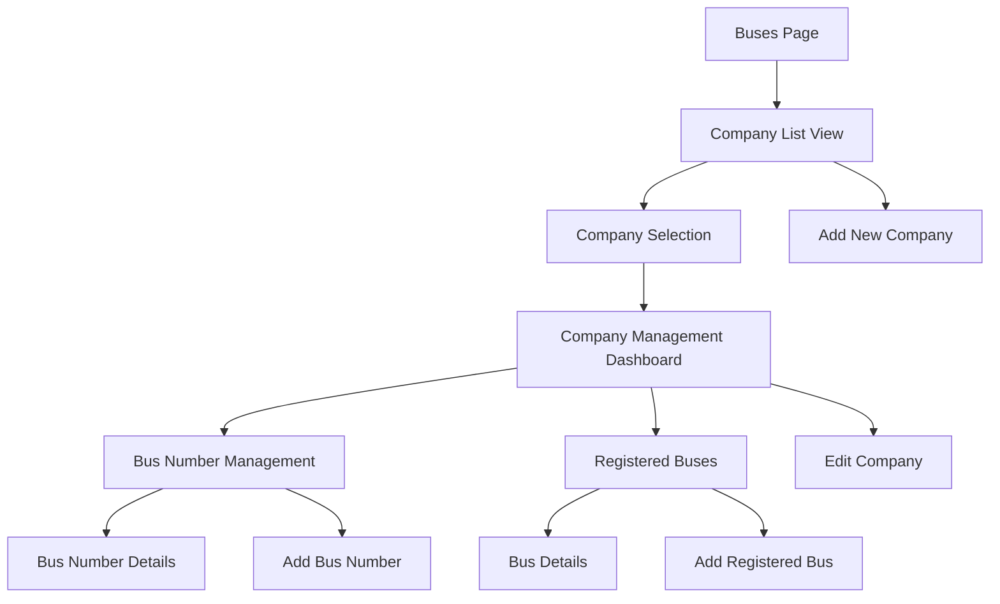
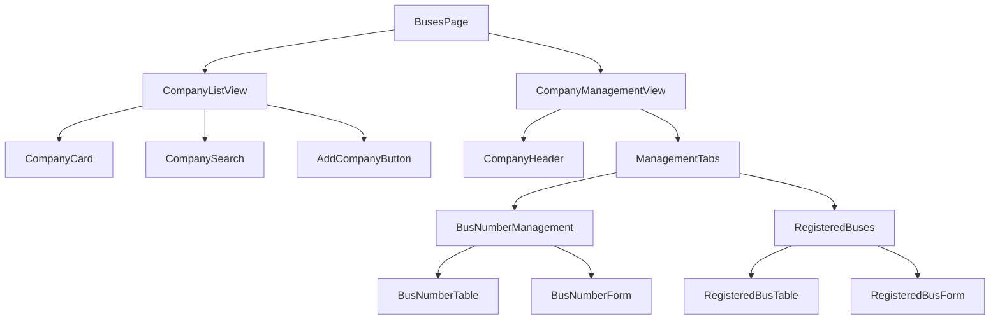

# Bus Company Management Design

## Overview

The Bus Company Management system provides a hierarchical interface for managing bus operations organized by company. The design follows a three-level navigation structure: Company List → Company Management → Bus Details, with clear navigation paths and context preservation.

## Architecture

### Navigation Flow



### Component Hierarchy



## Components and Interfaces

### 1. Data Models

```typescript
// Bus Company Interface
interface BusCompany {
  id: string;
  name: string;
  registrationNumber: string;
  companyCode: string;
  city: string;
  address?: string;
  contactInfo?: {
    phone?: string;
    email?: string;
  };
  status: 'active' | 'inactive' | 'suspended';
  createdAt: Date;
  updatedAt: Date;
}

// Bus Number Interface
interface BusNumber {
  id: string;
  companyId: string;
  busNumber: string;
  routeId?: string;
  routeName?: string;
  status: 'active' | 'inactive' | 'maintenance';
  assignedDriver?: string;
  capacity?: number;
  createdAt: Date;
  updatedAt: Date;
}

// Registered Bus Interface
interface RegisteredBus {
  id: string;
  companyId: string;
  registrationNumber: string;
  busNumber?: string;
  model: string;
  year: number;
  capacity: number;
  status: 'active' | 'inactive' | 'maintenance' | 'retired';
  routeAssignment?: {
    routeId: string;
    routeName: string;
    assignedAt: Date;
  };
  lastInspection?: Date;
  nextInspection?: Date;
  createdAt: Date;
  updatedAt: Date;
}

// Navigation State
interface NavigationState {
  currentView: 'company-list' | 'company-management';
  selectedCompany?: BusCompany;
  activeTab?: 'bus-numbers' | 'registered-buses';
  breadcrumbs: BreadcrumbItem[];
}

interface BreadcrumbItem {
  label: string;
  path: string;
  active: boolean;
}
```

### 2. Service Layer

```typescript
// Bus Company Service
class BusCompanyService {
  // Company operations
  async getAllCompanies(): Promise<BusCompany[]>
  async getCompanyById(id: string): Promise<BusCompany>
  async searchCompanies(query: string): Promise<BusCompany[]>
  async getCompaniesByCity(city: string): Promise<BusCompany[]>
  async getCompanyByRegistration(registrationNumber: string): Promise<BusCompany>
  async getCompanyByCode(companyCode: string): Promise<BusCompany>
  async createCompany(company: Partial<BusCompany>): Promise<BusCompany>
  async updateCompany(id: string, updates: Partial<BusCompany>): Promise<BusCompany>
  async deleteCompany(id: string): Promise<void>
  
  // Bus number operations
  async getBusNumbersByCompany(companyId: string): Promise<BusNumber[]>
  async createBusNumber(busNumber: Partial<BusNumber>): Promise<BusNumber>
  async updateBusNumber(id: string, updates: Partial<BusNumber>): Promise<BusNumber>
  async deleteBusNumber(id: string): Promise<void>
  
  // Registered bus operations
  async getRegisteredBusesByCompany(companyId: string): Promise<RegisteredBus[]>
  async createRegisteredBus(bus: Partial<RegisteredBus>): Promise<RegisteredBus>
  async updateRegisteredBus(id: string, updates: Partial<RegisteredBus>): Promise<RegisteredBus>
  async deleteRegisteredBus(id: string): Promise<void>
}
```

### 3. State Management

```typescript
// Company Management Context
interface CompanyManagementState {
  // Data
  companies: BusCompany[];
  selectedCompany: BusCompany | null;
  busNumbers: BusNumber[];
  registeredBuses: RegisteredBus[];
  
  // UI State
  loading: boolean;
  error: string | null;
  currentView: 'company-list' | 'company-management';
  activeTab: 'bus-numbers' | 'registered-buses';
  
  // Search and filters
  searchQuery: string;
  filters: {
    city?: string;
    status?: string;
  };
}

interface CompanyManagementActions {
  // Navigation
  selectCompany: (company: BusCompany) => void;
  goBackToCompanyList: () => void;
  setActiveTab: (tab: 'bus-numbers' | 'registered-buses') => void;
  
  // Data operations
  loadCompanies: () => Promise<void>;
  loadCompanyData: (companyId: string) => Promise<void>;
  searchCompanies: (query: string) => Promise<void>;
  
  // CRUD operations
  createCompany: (company: Partial<BusCompany>) => Promise<void>;
  updateCompany: (id: string, updates: Partial<BusCompany>) => Promise<void>;
  deleteCompany: (id: string) => Promise<void>;
}
```

## User Interface Design

### 1. Company List View

```typescript
// Layout Structure
const CompanyListView: React.FC = () => {
  return (
    <Box>
      {/* Header with search and add button */}
      <Box sx={{ display: 'flex', justifyContent: 'space-between', mb: 3 }}>
        <Typography variant="h4">Bus Companies</Typography>
        <Button variant="contained" startIcon={<AddIcon />}>
          Add Company
        </Button>
      </Box>
      
      {/* Search and filters */}
      <Paper sx={{ p: 2, mb: 3 }}>
        <CompanySearch />
        <CompanyFilters />
      </Paper>
      
      {/* Company grid */}
      <Grid container spacing={3}>
        {companies.map(company => (
          <Grid item xs={12} md={6} lg={4} key={company.id}>
            <CompanyCard company={company} onSelect={handleSelectCompany} />
          </Grid>
        ))}
      </Grid>
    </Box>
  );
};
```

### 2. Company Management View

```typescript
const CompanyManagementView: React.FC = () => {
  return (
    <Box>
      {/* Breadcrumb navigation */}
      <Breadcrumbs sx={{ mb: 2 }}>
        <Link onClick={goBackToCompanyList}>Companies</Link>
        <Typography color="text.primary">{selectedCompany.name}</Typography>
      </Breadcrumbs>
      
      {/* Company header */}
      <CompanyHeader company={selectedCompany} />
      
      {/* Management tabs */}
      <Tabs value={activeTab} onChange={handleTabChange}>
        <Tab label="Bus Number Management" value="bus-numbers" />
        <Tab label="Registered Buses" value="registered-buses" />
      </Tabs>
      
      {/* Tab content */}
      <TabPanel value={activeTab} index="bus-numbers">
        <BusNumberManagement companyId={selectedCompany.id} />
      </TabPanel>
      <TabPanel value={activeTab} index="registered-buses">
        <RegisteredBuses companyId={selectedCompany.id} />
      </TabPanel>
    </Box>
  );
};
```

### 3. Component Specifications

#### CompanyCard Component
```typescript
interface CompanyCardProps {
  company: BusCompany;
  onSelect: (company: BusCompany) => void;
}

const CompanyCard: React.FC<CompanyCardProps> = ({ company, onSelect }) => {
  return (
    <Card sx={{ cursor: 'pointer' }} onClick={() => onSelect(company)}>
      <CardContent>
        <Typography variant="h6">{company.name}</Typography>
        <Typography color="text.secondary">
          Code: {company.companyCode}
        </Typography>
        <Typography color="text.secondary">
          Registration: {company.registrationNumber}
        </Typography>
        <Typography color="text.secondary">
          City: {company.city}
        </Typography>
        <Chip 
          label={company.status} 
          color={company.status === 'active' ? 'success' : 'default'}
          size="small"
          sx={{ mt: 1 }}
        />
      </CardContent>
    </Card>
  );
};
```

#### BusNumberManagement Component
```typescript
const BusNumberManagement: React.FC<{ companyId: string }> = ({ companyId }) => {
  return (
    <Box>
      <Box sx={{ display: 'flex', justifyContent: 'space-between', mb: 2 }}>
        <Typography variant="h6">Bus Numbers</Typography>
        <Button variant="contained" startIcon={<AddIcon />}>
          Add Bus Number
        </Button>
      </Box>
      
      <DataGrid
        rows={busNumbers}
        columns={busNumberColumns}
        pageSize={10}
        checkboxSelection
        disableSelectionOnClick
      />
    </Box>
  );
};
```

## Data Flow and State Management

### 1. Navigation Flow

```typescript
// Navigation state management
const useCompanyNavigation = () => {
  const [navigationState, setNavigationState] = useState<NavigationState>({
    currentView: 'company-list',
    selectedCompany: undefined,
    activeTab: 'bus-numbers',
    breadcrumbs: [{ label: 'Companies', path: '/buses', active: true }]
  });

  const selectCompany = useCallback((company: BusCompany) => {
    setNavigationState(prev => ({
      ...prev,
      currentView: 'company-management',
      selectedCompany: company,
      breadcrumbs: [
        { label: 'Companies', path: '/buses', active: false },
        { label: company.name, path: `/buses/company/${company.id}`, active: true }
      ]
    }));
  }, []);

  const goBackToCompanyList = useCallback(() => {
    setNavigationState(prev => ({
      ...prev,
      currentView: 'company-list',
      selectedCompany: undefined,
      breadcrumbs: [{ label: 'Companies', path: '/buses', active: true }]
    }));
  }, []);

  return { navigationState, selectCompany, goBackToCompanyList };
};
```

### 2. Data Loading Strategy

```typescript
// Data loading with caching
const useCompanyData = () => {
  const [state, setState] = useState<CompanyManagementState>({
    companies: [],
    selectedCompany: null,
    busNumbers: [],
    registeredBuses: [],
    loading: false,
    error: null,
    currentView: 'company-list',
    activeTab: 'bus-numbers',
    searchQuery: '',
    filters: {}
  });

  const loadCompanies = useCallback(async () => {
    setState(prev => ({ ...prev, loading: true, error: null }));
    try {
      const companies = await busCompanyService.getAllCompanies();
      setState(prev => ({ ...prev, companies, loading: false }));
    } catch (error) {
      setState(prev => ({ 
        ...prev, 
        error: 'Failed to load companies', 
        loading: false 
      }));
    }
  }, []);

  const loadCompanyData = useCallback(async (companyId: string) => {
    setState(prev => ({ ...prev, loading: true }));
    try {
      const [busNumbers, registeredBuses] = await Promise.all([
        busCompanyService.getBusNumbersByCompany(companyId),
        busCompanyService.getRegisteredBusesByCompany(companyId)
      ]);
      setState(prev => ({ 
        ...prev, 
        busNumbers, 
        registeredBuses, 
        loading: false 
      }));
    } catch (error) {
      setState(prev => ({ 
        ...prev, 
        error: 'Failed to load company data', 
        loading: false 
      }));
    }
  }, []);

  return { state, loadCompanies, loadCompanyData };
};
```

## Error Handling

### 1. Error Types

```typescript
enum CompanyManagementErrorType {
  NETWORK_ERROR = 'NETWORK_ERROR',
  VALIDATION_ERROR = 'VALIDATION_ERROR',
  NOT_FOUND = 'NOT_FOUND',
  PERMISSION_DENIED = 'PERMISSION_DENIED',
  SERVER_ERROR = 'SERVER_ERROR'
}

interface CompanyManagementError {
  type: CompanyManagementErrorType;
  message: string;
  details?: any;
  timestamp: Date;
}
```

### 2. Error Handling Strategy

```typescript
const useErrorHandling = () => {
  const [errors, setErrors] = useState<CompanyManagementError[]>([]);

  const handleError = useCallback((error: any, context: string) => {
    const managementError: CompanyManagementError = {
      type: determineErrorType(error),
      message: getErrorMessage(error, context),
      details: error,
      timestamp: new Date()
    };

    setErrors(prev => [...prev, managementError]);
    
    // Show user-friendly notification
    showNotification(managementError.message, 'error');
  }, []);

  const clearErrors = useCallback(() => {
    setErrors([]);
  }, []);

  return { errors, handleError, clearErrors };
};
```

## Testing Strategy

### 1. Component Testing

```typescript
// Company card testing
describe('CompanyCard', () => {
  it('should display company information correctly', () => {
    const mockCompany = createMockCompany();
    render(<CompanyCard company={mockCompany} onSelect={jest.fn()} />);
    
    expect(screen.getByText(mockCompany.name)).toBeInTheDocument();
    expect(screen.getByText(`Code: ${mockCompany.companyCode}`)).toBeInTheDocument();
  });

  it('should call onSelect when clicked', () => {
    const mockCompany = createMockCompany();
    const onSelect = jest.fn();
    render(<CompanyCard company={mockCompany} onSelect={onSelect} />);
    
    fireEvent.click(screen.getByRole('button'));
    expect(onSelect).toHaveBeenCalledWith(mockCompany);
  });
});
```

### 2. Integration Testing

```typescript
// Navigation flow testing
describe('Company Management Navigation', () => {
  it('should navigate from company list to management view', async () => {
    render(<BusesPage />);
    
    // Should start with company list
    expect(screen.getByText('Bus Companies')).toBeInTheDocument();
    
    // Click on a company
    const companyCard = screen.getByText('Test Company');
    fireEvent.click(companyCard);
    
    // Should navigate to management view
    await waitFor(() => {
      expect(screen.getByText('Bus Number Management')).toBeInTheDocument();
    });
  });
});
```

## Performance Considerations

### 1. Data Loading Optimization

- **Lazy Loading**: Load company data only when selected
- **Caching**: Cache company list and recently viewed company data
- **Pagination**: Implement pagination for large company lists
- **Search Debouncing**: Debounce search queries to reduce API calls

### 2. Component Optimization

- **Memoization**: Use React.memo for expensive components
- **Virtual Scrolling**: For large lists of buses
- **Code Splitting**: Lazy load management views
- **Image Optimization**: Optimize company logos and bus images

## Security Considerations

### 1. Data Access Control

- **Role-based Access**: Different permissions for different user roles
- **Company Isolation**: Users can only access authorized companies
- **Audit Logging**: Log all management operations
- **Input Validation**: Validate all user inputs

### 2. API Security

- **Authentication**: Ensure all API calls are authenticated
- **Authorization**: Check permissions for each operation
- **Rate Limiting**: Prevent abuse of search and data loading
- **Data Sanitization**: Sanitize all user inputs before API calls