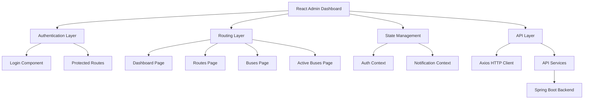

# Design Document

## Overview

The React Admin Dashboard is a single-page application (SPA) built with React 18+ that provides a comprehensive interface for managing bus transportation systems. The application follows modern React patterns using functional components, hooks, and context for state management. It integrates with a Spring Boot backend via REST APIs and provides a responsive, accessible user interface using Material-UI components.

## Architecture

### High-Level Architecture



### Component Architecture

The application follows a hierarchical component structure with clear separation of concerns:

- **Layout Components**: Handle overall page structure and navigation
- **Page Components**: Manage page-level state and orchestrate child components
- **Feature Components**: Handle specific business logic (tables, forms, modals)
- **UI Components**: Reusable presentational components

### State Management Strategy

- **React Context**: For global state (authentication, notifications)
- **Local State**: For component-specific state using useState and useReducer
- **Server State**: Managed through custom hooks with built-in caching and error handling

## Components and Interfaces

### Core Layout Components

#### AppLayout
- **Purpose**: Main application wrapper with sidebar navigation
- **Props**: `children: ReactNode`
- **State**: Navigation collapse state, current route
- **Responsibilities**: 
  - Render sidebar navigation
  - Handle responsive layout changes
  - Provide consistent header/footer

#### Sidebar
- **Purpose**: Navigation menu with route highlighting
- **Props**: `collapsed: boolean, onToggle: () => void`
- **State**: Active route tracking
- **Responsibilities**:
  - Display navigation items
  - Highlight current route
  - Handle mobile responsive behavior

### Page Components

#### Dashboard
- **Purpose**: Overview page with key statistics
- **State**: Statistics data, loading states
- **API Calls**: 
  - GET /api/dashboard/stats
- **Responsibilities**:
  - Display summary cards (total routes, buses, active buses)
  - Show recent activity
  - Provide quick navigation to other sections

#### RoutesPage
- **Purpose**: Route management interface
- **State**: Routes list, selected route, modal states
- **API Calls**:
  - GET /api/routes
  - POST /api/routes
  - PUT /api/routes/{id}
  - DELETE /api/routes/{id}
- **Child Components**: RouteTable, RouteForm, ConfirmDialog

#### BusesPage
- **Purpose**: Bus fleet management interface
- **State**: Buses list, selected bus, modal states
- **API Calls**:
  - GET /api/buses
  - POST /api/buses
  - PUT /api/buses/{id}
  - DELETE /api/buses/{id}
- **Child Components**: BusTable, BusForm, ConfirmDialog

#### ActiveBusesPage
- **Purpose**: Real-time bus monitoring interface
- **State**: Active buses list, filters, refresh interval
- **API Calls**:
  - GET /api/active-buses
- **Child Components**: ActiveBusList, FilterPanel
- **Special Features**: Auto-refresh every 30 seconds

### Feature Components

#### RouteTable
- **Purpose**: Display routes in tabular format with actions
- **Props**: `routes: Route[], onEdit: (route) => void, onDelete: (id) => void`
- **Features**: Sorting, pagination, action buttons
- **Accessibility**: ARIA labels, keyboard navigation

#### RouteForm
- **Purpose**: Form for creating/editing routes
- **Props**: `route?: Route, onSubmit: (data) => void, onCancel: () => void`
- **Validation**: Client-side validation using react-hook-form
- **Fields**: Route name, start/end points, stops, schedule

#### BusTable
- **Purpose**: Display buses in tabular format with actions
- **Props**: `buses: Bus[], onEdit: (bus) => void, onDelete: (id) => void`
- **Features**: Sorting, pagination, status indicators
- **Accessibility**: ARIA labels, keyboard navigation

#### BusForm
- **Purpose**: Form for creating/editing buses
- **Props**: `bus?: Bus, onSubmit: (data) => void, onCancel: () => void`
- **Validation**: Client-side validation using react-hook-form
- **Fields**: Bus number, capacity, model, status, assigned route

#### ActiveBusList
- **Purpose**: Display active buses with real-time status
- **Props**: `buses: ActiveBus[], filters: FilterState`
- **Features**: Status indicators, location display, filtering
- **Real-time**: Updates via polling or WebSocket connection

### Authentication Components

#### LoginForm
- **Purpose**: User authentication interface
- **State**: Form data, loading, error states
- **API Calls**: POST /api/auth/login
- **Validation**: Email/username and password validation
- **Security**: CSRF protection, secure token storage

#### ProtectedRoute
- **Purpose**: Route wrapper for authenticated access
- **Props**: `children: ReactNode, requiredRole?: string`
- **Logic**: Check authentication status and redirect if needed

## Data Models

### Route Model
```typescript
interface Route {
  id: string;
  name: string;
  startPoint: string;
  endPoint: string;
  stops: Stop[];
  schedule: Schedule[];
  isActive: boolean;
  createdAt: Date;
  updatedAt: Date;
}

interface Stop {
  id: string;
  name: string;
  coordinates: {
    lat: number;
    lng: number;
  };
  order: number;
}

interface Schedule {
  id: string;
  departureTime: string;
  arrivalTime: string;
  daysOfWeek: string[];
}
```

### Bus Model
```typescript
interface Bus {
  id: string;
  busNumber: string;
  capacity: number;
  model: string;
  year: number;
  status: 'active' | 'maintenance' | 'retired';
  assignedRouteId?: string;
  assignedRoute?: Route;
  createdAt: Date;
  updatedAt: Date;
}
```

### ActiveBus Model
```typescript
interface ActiveBus {
  id: string;
  bus: Bus;
  route: Route;
  currentLocation: {
    lat: number;
    lng: number;
  };
  nextStop: Stop;
  estimatedArrival: Date;
  passengerCount: number;
  status: 'on_route' | 'at_stop' | 'delayed';
  lastUpdated: Date;
}
```

### User Model
```typescript
interface User {
  id: string;
  username: string;
  email: string;
  role: 'admin' | 'operator';
  isActive: boolean;
  lastLogin: Date;
}
```

## Error Handling

### API Error Handling Strategy

#### Error Types
- **Network Errors**: Connection failures, timeouts
- **HTTP Errors**: 4xx client errors, 5xx server errors
- **Validation Errors**: Form validation failures
- **Authentication Errors**: Token expiration, unauthorized access

#### Error Handling Implementation

```typescript
// Custom hook for API error handling
const useApiError = () => {
  const { showNotification } = useNotification();
  
  const handleError = (error: ApiError) => {
    switch (error.type) {
      case 'NETWORK_ERROR':
        showNotification('Network connection failed. Please check your internet connection.', 'error');
        break;
      case 'VALIDATION_ERROR':
        return error.fieldErrors; // Return for form-specific handling
      case 'UNAUTHORIZED':
        // Redirect to login
        window.location.href = '/login';
        break;
      case 'SERVER_ERROR':
        showNotification('Server error occurred. Please try again later.', 'error');
        break;
      default:
        showNotification('An unexpected error occurred.', 'error');
    }
  };
  
  return { handleError };
};
```

#### Form Validation
- Client-side validation using react-hook-form with yup schema
- Real-time validation feedback
- Server-side validation error display
- Accessibility-compliant error messages

#### Loading States
- Skeleton loaders for table data
- Spinner indicators for form submissions
- Progress bars for file uploads
- Disabled states during API operations

## Testing Strategy

### Unit Testing
- **Components**: Test rendering, props handling, user interactions
- **Hooks**: Test custom hooks in isolation
- **Utilities**: Test helper functions and API services
- **Tools**: Jest, React Testing Library

### Integration Testing
- **API Integration**: Test API service functions with mock responses
- **Component Integration**: Test component interactions and data flow
- **Authentication Flow**: Test login/logout and protected routes

### End-to-End Testing
- **User Workflows**: Test complete user journeys
- **Cross-browser Testing**: Ensure compatibility across browsers
- **Responsive Testing**: Test on different screen sizes
- **Tools**: Cypress or Playwright

### Testing Coverage Goals
- Unit tests: 80%+ coverage
- Integration tests: Key user flows
- E2E tests: Critical business processes

## Performance Considerations

### Code Splitting
- Route-based code splitting using React.lazy()
- Component-level splitting for large components
- Third-party library splitting

### Optimization Strategies
- **Memoization**: React.memo for expensive components
- **Virtual Scrolling**: For large data tables
- **Image Optimization**: Lazy loading and responsive images
- **Bundle Analysis**: Regular bundle size monitoring

### Caching Strategy
- **API Response Caching**: Cache GET requests with TTL
- **Static Asset Caching**: Browser caching for assets
- **Service Worker**: Offline functionality for critical features

## Security Considerations

### Authentication & Authorization
- JWT token-based authentication
- Secure token storage (httpOnly cookies preferred)
- Token refresh mechanism
- Role-based access control

### Data Protection
- Input sanitization and validation
- XSS prevention through proper escaping
- CSRF protection for state-changing operations
- Secure API communication (HTTPS only)

### Security Headers
- Content Security Policy (CSP)
- X-Frame-Options
- X-Content-Type-Options
- Referrer-Policy

## Deployment Architecture

### Build Process
- Create React App build system
- Environment-specific configuration
- Asset optimization and minification
- Source map generation for debugging

### Deployment Options

#### Option 1: Static Hosting
- Build artifacts served from CDN
- Separate API backend deployment
- Environment variables for API endpoints

#### Option 2: Integrated with Spring Boot
- React build served from Spring Boot static resources
- Single deployment artifact
- Shared session management

### Environment Configuration
- Development: Local API, hot reloading
- Staging: Staging API, production build
- Production: Production API, optimized build

## Accessibility Compliance

### WCAG 2.1 AA Compliance
- Semantic HTML structure
- ARIA labels and roles
- Keyboard navigation support
- Color contrast compliance
- Screen reader compatibility

### Implementation Details
- Focus management for modals and forms
- Skip navigation links
- Alternative text for images
- Form labels and error associations
- Responsive design for zoom up to 200%